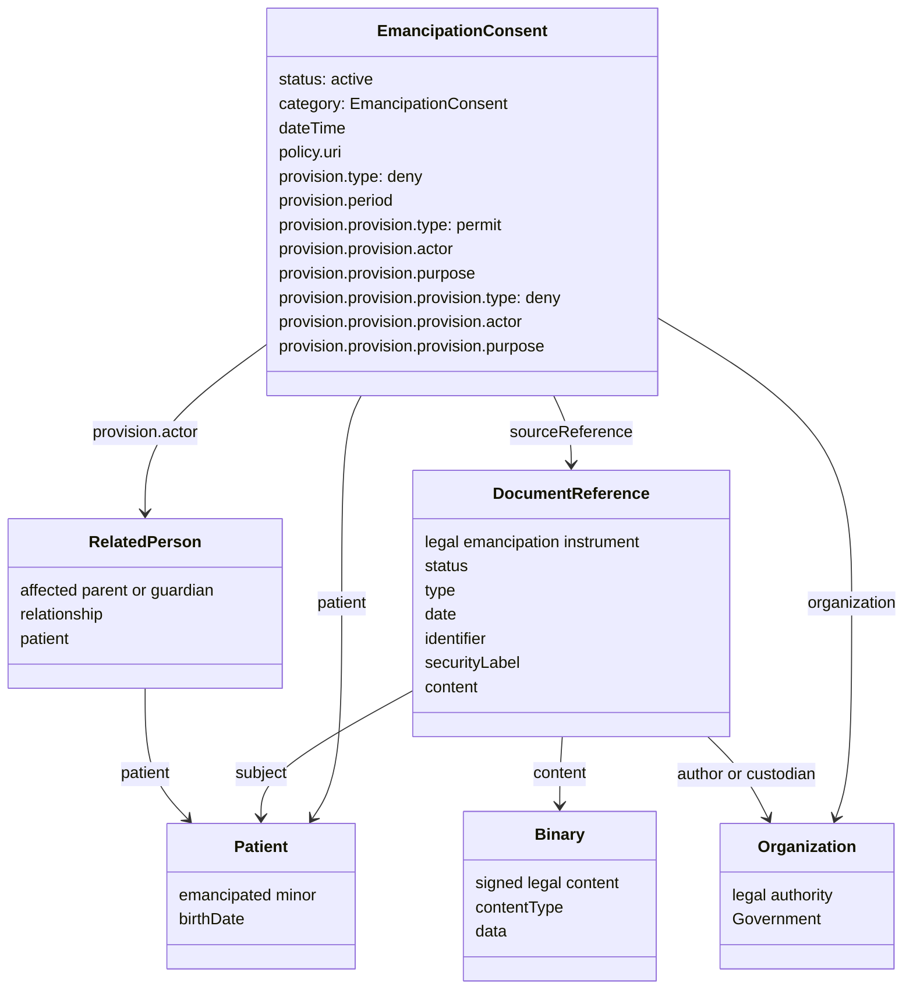

This is an experimental IG. The content is fully from the perspective of the author, and is not endorsed by HL7 or any other organization. It is intended to be a discussion starter, and to solicit feedback from the community.

### Scope

This IG focuses on a use-case where the subject is a minor who has been emancipated.

Emancipation is a legal status, established under the law of a particular jurisdiction, in which a minor gains some or all of the legal independence normally associated with adulthood. The exact meaning varies by jurisdiction and by the order or other legal instrument that establishes it. It can be limited in scope, effective only from a stated date, subject to conditions, or later modified or revoked. It should not be inferred solely from age, living situation, or the minor's assertion.

### Implementation

- Patient resource is used to identify the Patient
- Consent resource is used to document the Patient has legal status as emancipated.
- DocumentReference and Binary resources are used to capture the legal paperwork that documents the emancipation.

### Legal Attributes and FHIR Representation

The signed court order, decree, or other legally recognized instrument is the authoritative statement of emancipation. A FHIR Consent should not replace that instrument or imply that emancipation is universal or irrevocable. It records the healthcare organization's current, actionable interpretation of the legal status, particularly when it affects access to or control of the patient's information.

Typical attributes that should be available to an implementer or reviewer include:

- the governing jurisdiction and the legal authority that issued or recognized the status;
- the type of instrument, its identifier or case number, and the date it was issued;
- the effective date, expiration date if any, and current legal status;
- the scope of independence granted and any exceptions, restrictions, or retained parental or guardian rights;
- a reference to the signed or certified source document; and
- the organization that verified the instrument, the verification date, and a way to recognize a later amendment, replacement, or revocation.

The source document and its retention metadata belong in `DocumentReference` and, where appropriate, its `Binary` content. `DocumentReference.subject`, `author`, `custodian`, `date`, `identifier`, `type`, and `securityLabel` can carry document-level metadata. The issuing court, agency, or other authority should be represented by an `Organization` and referenced from the document or an extension when that relationship needs to be explicit.

`Consent` should contain the patient, current status, organization applying the policy, the `sourceReference` to the legal document, and only those `provision` rules that the organization can actually enforce. Its `dateTime` should identify the consent decision or policy presentation event, rather than stand in for the effective date of the legal emancipation. If jurisdiction, legal-authority identity, effective period, verification, or restriction details must be exchanged and processed as structured data, define and document extensions for those data elements. Do not use free text in a Consent provision when an access-control engine must reliably evaluate the restriction.

Emancipation can terminate, limit, or leave unchanged a parent's authority to access a minor's health information, depending on the governing law and the legal instrument. Therefore, a system must not assume either that every parent is forbidden access or that every emancipation grants unrestricted access. When a reviewed instrument requires the organization to deny parental or guardian access, represent each affected individual with a `RelatedPerson` resource that positively identifies the relationship to the patient. FHIR R4 has one root `Consent.provision`; its `type` establishes the overall direction. Use nested `provision` elements for exceptions, changing from `deny` to `permit`, or from `permit` to `deny`, at each level. Reference the relevant `RelatedPerson` in the nested `Consent.provision.actor` and constrain the rule to the data and purposes the organization must enforce. The `RelatedPerson` asserts the relationship; the referenced legal document supports the access decision.

### Consent profiling

As with any Consent, often there is paperwork that ultimately holds the legal details. This legal paperwork is critical to overall legal precedent, and represents the ceremony of the act of consent from the patient. These details should be captured by a DocumentReference and Binary. The Consent.sourceReference would then point at that DocumentReference. (Could use Consent.sourceAttachment, but I am not a fan of bloating the Consent with that detail).

The Consent then would need to be profiled. The main difference from the FHIR core [Consent](http://hl7.org/fhir/consent.html) I outlined in my [Consent article](https://healthcaresecprivacy.blogspot.com/2022/05/explaining-fhir-consent-examples.html) is that this would be a specific kind of Consent.

- status - would indicate active
- category - would indicate patient consent, specifically an emancipation
- patient - would indicate the Patient resource reference for the given patient
- dateTime - would indicate when the privacy policy was presented
- performer - would indicate the Patient resource if the patient was presented, a RelatedPerson for parent or guardian
- organization - would indicate the Organization that legally recognizes the emancipation (e.g., the State)
- source - would point at the specific signed legal emancipation text
- policy.uri - would indicate the privacy policy that was presented. Usually, the url to the version-specific policy
- provision.type - deny - is the single root provision and establishes the overall direction required by the applicable law and the legal emancipation instrument.
- provision.provision.type - permit - is an exception to the root denial, for access expressly retained by law or the legal instrument.
- provision.provision.provision.type - deny - is an exception to that permit. Each deeper provision alternates the prior provision's direction.
- provision.provision.actor.reference - would reference the `RelatedPerson` that identifies the affected parent or guardian.
- provision.provision.actor.role - would identify the parent's or guardian's relationship or authority.
- provision.provision.purpose - would constrain the access purposes to which the rule applies.

Profiled Consent for [Emancipation](StructureDefinition-EmancipationConsent.html) is included in this IG.

#### Contract resource

The Contract resource could also be used, but it is much less mature and is way too complex to simply carry a simple emancipation fact with paperwork. Therefore it is not included in this IG.

#### using Consent to enable access control

One advantage of using a Consent resource as defined here is that there would be a natural set of provisions in a Consent that would be processable by an Access Control engine that understands Consent. This Access Control engine would resolve the requesting person to the relevant RelatedPerson and apply the Consent deny or permit rules to mediate access to that Patient's data.

### Parents (other) access

A `RelatedPerson` is a positive statement that a person is related to the patient; it should not be used to assert that the relationship has been negated. The applicable access restriction belongs in a Consent provision that references that RelatedPerson, supported by the legal emancipation document.

### Examples

- [Patient](Patient-ex-patient.html)
- [Consent from the Patient indicating emancipation](Consent-ex-consent.html)
- [DocumentReference for the legal emancipation paperwork](DocumentReference-ex-documentreference.html)
- [RelatedPerson for Father](RelatedPerson-ex-father.html)
- [RelatedPerson for Mother](RelatedPerson-ex-mother.html)
- [Organization for the State that issued the emancipation](Organization-ex-organization.html)
